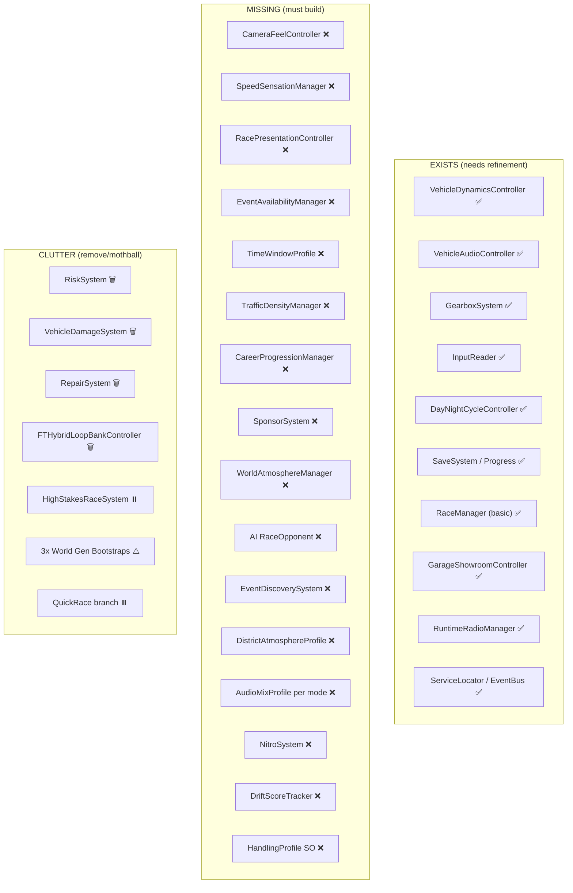

# Full Throttle: Underground — Complete Rebuild Masterplan

> **Date:** 2026-04-17  
> **Source Documents:** [UG2_REVERSE_SPEC.md](file:///c:/Users/Marc%20Badua/Documents/GitHub/Full-Throttle--Underground/Docs/UG2_REVERSE_SPEC.md) + [FULL_THROTTLE_NFSU2_OVERHAUL_DAYCYCLE_MASTERPLAN.md](file:///c:/Users/Marc%20Badua/Documents/GitHub/Full-Throttle--Underground/Docs/FULL_THROTTLE_NFSU2_OVERHAUL_DAYCYCLE_MASTERPLAN.md)  
> **Goal:** Strip the clutter, kill the dead-end side quests, and rebuild Full Throttle into the UG2-spirited, day-cycle-differentiated street racer it was always meant to be.

---

## Table of Contents

1. [Executive Summary](#1-executive-summary)
2. [Full Codebase Audit](#2-full-codebase-audit)
3. [Dead-End Systems (The Clutter)](#3-dead-end-systems-the-clutter)
4. [Gap Analysis: Current vs. Target](#4-gap-analysis-current-vs-target)
5. [Rebuild Architecture](#5-rebuild-architecture)
6. [Phase 1 — PlayerCar Feel](#6-phase-1--playercar-feel)
7. [Phase 2 — One Race Loop](#7-phase-2--one-race-loop)
8. [Phase 3 — Day-Cycle Backbone](#8-phase-3--day-cycle-backbone)
9. [Phase 4 — Garage & Progression](#9-phase-4--garage--progression)
10. [Phase 5 — AI & Event Variety](#10-phase-5--ai--event-variety)
11. [Phase 6 — Atmosphere & Polish](#11-phase-6--atmosphere--polish)
12. [File-Level Action Map](#12-file-level-action-map)
13. [First Playable Milestone](#13-first-playable-milestone)

---

## 1. Executive Summary

Full Throttle has accumulated **significant side-quest debt** — systems that were started, partially built, but never integrated into a cohesive gameplay loop. These include:

- A **Risk/Wager system** that has no UI, no race integration, and no player-facing flow
- A **Vehicle Damage/Repair economy** that conflicts with UG2's bounce-off-wall-and-keep-racing philosophy
- A **legacy audio controller** (`FTHybridLoopBankController`) that was superseded by `VehicleAudioController` but still lingers
- A **procedural world generation pipeline** that bulldozes hand-authored scenes at runtime
- **Duplicate world bootstrap systems** — `WorldGenerationBootstrap` vs `ProceduralWorldBootstrap` vs `FastWorldGenerator`
- A **QuickRace flow** that bypasses the career loop entirely
- Service architecture abstractions (`IRiskService`, `ISaveService`, etc.) for systems that barely exist

The result is a game that feels like a sandbox of half-experiments rather than a focused UG2-inspired racer. **This plan strips it to the spine and rebuilds outward.**

---

## 2. Full Codebase Audit

### 2.1 Script Directory Inventory

| Directory | Files | Status | Notes |
|---|---|---|---|
| `Scripts/Vehicle/` | 15 .cs files | **CORE** — Mostly strong | VehicleDynamicsController is solid. Some clutter (VehicleDamageSystem). |
| `Scripts/Audio/` | 6 .cs files | **MIXED** — Legacy conflict | `FTHybridLoopBankController` is dead weight. `VehicleAudioController` is the canonical system. |
| `Scripts/Camera/` | Empty | **GAP** — Critical missing system | No chase cam controller exists as its own component. Camera is embedded in `VehicleCameraFollow.cs` under Vehicle/. |
| `Scripts/Core/` | 3 + Architecture/ | **KEEP** — Foundation is clean | `ServiceLocator`, `EventBus`, `GameplayEvents` are well-structured. |
| `Scripts/Race/` | 8 .cs files | **REFACTOR** — Needs overhaul | `RaceManager` is monolithic. `HighStakesRaceSystem` is dead. Race types are not properly separated. |
| `Scripts/AI/` | 2 .cs files | **SKELETON** — Barely exists | `AIWaypointFollower` and `TrafficSpawner` are stubs. |
| `Scripts/Garage/` | 5 .cs files | **MIXED** — Some dead weight | `RepairSystem` is tied to dead VehicleDamageSystem. `GarageShowroomController` is functional. |
| `Scripts/Progression/` | 1 .cs file | **SKELETON** — Barely exists | Only `VehicleOwnershipSystem` with minimal wager support. No career stages, no sponsor system. |
| `Scripts/Economy/` | Empty | **GAP** — Nothing here | Was moved to Progression. Directory is a ghost. |
| `Scripts/Save/` | 3 .cs files | **KEEP** — Functional | `PersistentProgressManager`, `SaveGameData`, `SaveSystem` work. |
| `Scripts/Session/` | 3 .cs files | **REFACTOR** — Over-engineered for what exists | `RiskSystem` is unused. `SessionManager` has good bones. |
| `Scripts/Radio/` | 4 .cs files | **KEEP** — Feature complete | MP3 radio system works. Aligns with UG2 atmosphere needs. |
| `Scripts/TimeSystem/` | 3 .cs files | **REFACTOR** — Key differentiator | `DayNightCycleController` is large (42KB) but needs integration with event/world systems. |
| `Scripts/UI/` | 17 .cs files | **MIXED** — Bloated | Multiple overlapping menu controllers. QuickRace UI is a side quest. `StylizedHudComposer` and `HUDController` overlap. |
| `Scripts/Editor/` | 22 .cs files | **HEAVY** — Builder sprawl | `UndergroundPrototypeBuilder` split across 9 partial class files (~300KB total). Some are necessary, some are over-engineered. |
| `Scripts/World/` | 20 + ProceduralGen/ (15) | **CRITICAL PROBLEM** — The bulldozer | Multiple competing world-gen systems that destroy hand-authored content at runtime. |
| `Scripts/Input/` | 1 .cs file | **KEEP** — Clean | `InputReader` is well-structured. |
| `Scripts/Systems/` | Empty (gitkeep only) | **GAP** — Placeholder | Never populated. |
| `Scripts/Utilities/` | Empty | **GAP** — Placeholder | Never populated. |

### 2.2 Non-Script Observations

| Item | Status |
|---|---|
| `Assets/DayNight/Scripts/TimeOfDay.cs` | **LEGACY** — 3rd-party package script, uses obsolete `UnityEngine.UI.Text`. Superseded by `DayNightCycleController`. |
| `Backup/VehicleDynamicsController.cs` | **DEAD** — Old backup, 45KB. Should be deleted. |
| `Backup/World.unity` | **DEAD** — 195MB scene backup. Should not be in repo. |
| `NFS Audio Extractor/` | **TOOL** — Keep as reference tool, not game runtime. |

---

## 3. Dead-End Systems (The Clutter)

These are the systems that **must be removed or mothballed** because they pull the game away from UG2:

### 3.1 🗑️ Risk System — REMOVE

| File | Problem |
|---|---|
| [RiskSystem.cs](file:///c:/Users/Marc%20Badua/Documents/GitHub/Full-Throttle--Underground/Assets/Scripts/Session/RiskSystem.cs) | Accumulates "risk" on earning money/rep. No UI, no player-facing mechanic. |
| [IRiskService.cs](file:///c:/Users/Marc%20Badua/Documents/GitHub/Full-Throttle--Underground/Assets/Scripts/Core/Architecture/IRiskService.cs) | Interface for dead system. |
| [RiskChangedEvent](file:///c:/Users/Marc%20Badua/Documents/GitHub/Full-Throttle--Underground/Assets/Scripts/Core/Architecture/GameplayEvents.cs#L37-L45) | Event for dead system. |

**Why:** UG2 doesn't have a "risk" meta-layer. This is a roguelike mechanic that doesn't belong. The `SessionManager` currently increases risk every time the player earns money — that's anti-UG2 "one more race" philosophy.

### 3.2 🗑️ Vehicle Damage + Repair Economy — REMOVE

| File | Problem |
|---|---|
| [VehicleDamageSystem.cs](file:///c:/Users/Marc%20Badua/Documents/GitHub/Full-Throttle--Underground/Assets/Scripts/Vehicle/VehicleDamageSystem.cs) | Collision damage → totaled car → forced garage return. **Directly contradicts** UG2 spec §1.4: "Cars bounce off walls with high restitution but low speed loss. No crumple simulation." |
| [RepairSystem.cs](file:///c:/Users/Marc%20Badua/Documents/GitHub/Full-Throttle--Underground/Assets/Scripts/Garage/RepairSystem.cs) | Repair cost economy for a damage system that shouldn't exist. |

**Why:** In UG2, hitting a wall is a "bump and go" moment. In the current Full Throttle, hitting a wall enough causes `OnVehicleTotalled()` → session wipe → forced scene load to garage. This is **the opposite** of the UG2 feel.

### 3.3 🗑️ High-Stakes Wager Races — MOTHBALL (Late Night only, Phase 5+)

| File | Problem |
|---|---|
| [HighStakesRaceSystem.cs](file:///c:/Users/Marc%20Badua/Documents/GitHub/Full-Throttle--Underground/Assets/Scripts/Race/HighStakesRaceSystem.cs) | Night-only wager race with car loss. Interesting for Late Night tier but requires damage/totalled system which conflicts with core feel. |

**Why:** The concept aligns with the Day-Cycle Masterplan's "Late Night = risk, exclusivity, legend-making" window. But it currently depends on `VehicleDamageSystem` and `VehicleOwnershipSystem.CanWagerCurrentCar()`. Needs complete redesign if kept — lose rep/money, never lose your car.

### 3.4 🗑️ Legacy Audio Controller — REMOVE

| File | Problem |
|---|---|
| [FTHybridLoopBankController.cs](file:///c:/Users/Marc%20Badua/Documents/GitHub/Full-Throttle--Underground/Assets/Scripts/Audio/FTHybridLoopBankController.cs) | 504 lines. Already has `HasActiveVehicleAudioController()` check that auto-disables when the canonical `VehicleAudioController` exists. This is a zombie — still on some prefabs, still confusing. |
| [FTLoopBankProfile.cs](file:///c:/Users/Marc%20Badua/Documents/GitHub/Full-Throttle--Underground/Assets/Scripts/Audio/FTLoopBankProfile.cs) | ScriptableObject for the dead controller. |

**Why:** `VehicleAudioController` (47KB, 8-band bank system with sweeps) already matches the UG2 spec. The hybrid controller was the pre-UG2 attempt. Kill it.

### 3.5 ⚠️ Procedural World Generation — DISABLE/GATE

| File | Problem |
|---|---|
| [WorldGenerationBootstrap.cs](file:///c:/Users/Marc%20Badua/Documents/GitHub/Full-Throttle--Underground/Assets/Scripts/World/WorldGenerationBootstrap.cs) | Destroys existing scene objects, generates FCG zones, builds highways — runs at startup and wipes hand-authored content. |
| [ProceduralWorldBootstrap.cs](file:///c:/Users/Marc%20Badua/Documents/GitHub/Full-Throttle--Underground/Assets/Scripts/World/ProceduralGen/ProceduralWorldBootstrap.cs) | Second competing world gen system. |
| [FastWorldGenerator.cs](file:///c:/Users/Marc%20Badua/Documents/GitHub/Full-Throttle--Underground/Assets/Scripts/World/ProceduralGen/FastWorldGenerator.cs) | Third competing approach. |

**Why:** Having 3 world gen systems that compete and none that are stable is the textbook definition of "side quest clutter." The authored `world.unity` scene should be the canonical world. Proc-gen should be an **editor tool**, not a runtime destroyer.

### 3.6 🗑️ QuickRace Side Branch — DEPRIORITIZE

| File | Problem |
|---|---|
| [QuickRaceSessionData.cs](file:///c:/Users/Marc%20Badua/Documents/GitHub/Full-Throttle--Underground/Assets/Scripts/Session/QuickRaceSessionData.cs) | Static session data for quick races. |
| [QuickRaceRuntimeBootstrap.cs](file:///c:/Users/Marc%20Badua/Documents/GitHub/Full-Throttle--Underground/Assets/Scripts/World/QuickRaceRuntimeBootstrap.cs) | Runtime bootstrap that bypasses normal flow. |
| [QuickRaceFlowManager.cs](file:///c:/Users/Marc%20Badua/Documents/GitHub/Full-Throttle--Underground/Assets/Scripts/UI/QuickRaceFlowManager.cs) | UI manager for quick race menu. |
| [QuickRaceSelectionPanelManager.cs](file:///c:/Users/Marc%20Badua/Documents/GitHub/Full-Throttle--Underground/Assets/Scripts/UI/QuickRaceSelectionPanelManager.cs) | 29KB panel manager. |

**Why:** QuickRace is a developer debug tool, not UG2 gameplay. UG2 doesn't have a "Quick Race" mode — you discover events in the world. This entire branch adds complexity without serving the core loop.

---

## 4. Gap Analysis: Current vs. Target

### What the specs demand vs. what currently exists:



### Critical Missing Systems Count

| Domain | Spec Requirements | Currently Exists | Gap |
|---|---|---|---|
| **Driving Feel** | Handling + Drift + NOS + Speed Sensation + Camera | Handling ✅, Drift partial, rest ❌ | **3 systems missing** |
| **Audio** | 8-band bank + sweeps + turbo + skid + NOS + reverb zones + mix profiles | Bank ✅, sweeps ✅, turbo partial, rest ❌ | **4 systems missing** |
| **Race Loop** | Event trigger → presentation → countdown → race → results → return | Basic trigger → race → finish exists | **Presentation layer missing** |
| **Day Cycle** | 4 time windows driving events, traffic, atmosphere, audio | `DayNightCycleController` exists (lighting only) | **Event/traffic/atmosphere integration missing** |
| **Progression** | 5 career stages, sponsors, rep, part unlocks, star rating | Basic money/rep/save exists | **Career structure missing entirely** |
| **AI** | Spline pathing, catch-up, aggression, mistakes, launch behavior | `AIWaypointFollower` stub only | **Entire AI system missing** |
| **World** | Districts with identity, event density, shops, visual pacing | Procedural gen chaos | **Needs stabilization, not more generation** |

---

## 5. Rebuild Architecture

### 5.1 Target Component Architecture (per UG2 Spec Appendix C)

```
PlayerCar (root GameObject)
├── Rigidbody
├── VehicleDynamicsController        ← EXISTS, refine
├── GearboxSystem                    ← EXISTS, keep
├── InputReader                      ← EXISTS, keep
├── PlayerCarAppearanceController    ← EXISTS, keep
├── VehicleAudioController           ← EXISTS, refine
│   └── NFSU2ArchiveAudio (child)    ← EXISTS, keep
├── VehicleAudioTierSelector         ← EXISTS, keep
├── NitroSystem                      ← NEW: build
├── DriftScoreTracker                ← NEW: build
├── VehicleNightLightingController   ← EXISTS, keep
└── VehicleCameraFollow              ← EXISTS, refactor into CameraFeelController
```

### 5.2 Target ScriptableObjects

| ScriptableObject | Status | Purpose |
|---|---|---|
| `NFSU2CarAudioBank` | ✅ Exists | Per-car audio definition |
| `HandlingProfile` | ❌ **NEW** | Per-car handling tuning (extract from VehicleStatsData) |
| `CameraFeelProfile` | ❌ **NEW** | Per-car camera tuning (FOV ramp, pullback, NOS punch) |
| `PerformanceTier` | ❌ **NEW** | Stage-based upgrade tier stats |
| `RaceRoute` | ❌ **NEW** | Per-event route spline definition |
| `AudioMixProfile` | ❌ **NEW** | Per-mode audio balance (drift, drag, URL, free-roam) |
| `TimeWindowProfile` | ❌ **NEW** | Day/Sunset/Night/Late-Night window definitions |
| `EventScheduleProfile` | ❌ **NEW** | Which events appear at which time windows |
| `CareerStageProfile` | ❌ **NEW** | Stage requirements, unlocks, district access |
| `DistrictAtmosphereProfile` | ❌ **NEW** | Per-district, per-time-window atmosphere settings |
| `PlayerCarCatalog` | ✅ Exists | Vehicle roster |
| `VehicleStatsData` | ✅ Exists | Will be supplemented by HandlingProfile |

### 5.3 Target Singleton Managers

| Manager | Status | Drives |
|---|---|---|
| `TimeOfDayManager` | 🔄 Refactor from `DayNightCycleController` | Light, sky, fog, exposure, emissive intensity |
| `EventAvailabilityManager` | ❌ **NEW** | Which events are active based on time window + career stage |
| `TrafficDensityManager` | ❌ **NEW** | Traffic count/behavior per time window |
| `WorldAtmosphereManager` | ❌ **NEW** | District mood per time window |
| `CareerProgressionManager` | ❌ **NEW** | Stage tracking, sponsor contracts, unlock gates |
| `RacePresentationController` | ❌ **NEW** | Countdown → race → results → return flow |

---

## 6. Phase 1 — PlayerCar Feel

> **Goal:** The car must feel good before anything else matters.  
> **Duration:** 2–3 weeks

### Actions

| # | Action | File(s) | Details |
|---|---|---|---|
| 1.1 | **Remove VehicleDamageSystem** | `Vehicle/VehicleDamageSystem.cs` | Delete. UG2 spec §1.4: "No crumple simulation." Replace collision behavior with bounce + brief camera dampen. |
| 1.2 | **Remove Risk references from SessionManager** | `Session/SessionManager.cs` | Strip `riskSystem` field and all `riskSystem?.IncreaseRisk()` calls. |
| 1.3 | **Create HandlingProfile SO** | `Vehicle/HandlingProfile.cs` (NEW) | Extract tuning values from `VehicleDynamicsController` serialized fields into a swappable ScriptableObject. Per UG2 spec §1.2. |
| 1.4 | **Create NitroSystem** | `Vehicle/NitroSystem.cs` (NEW) | NOS gauge, activation, sustained boost, cooldown. Per UG2 spec §1.5 (NOS punch). Drives FOV spike + camera push + audio. |
| 1.5 | **Refactor VehicleCameraFollow → CameraFeelController** | `Vehicle/VehicleCameraFollow.cs` → `Camera/CameraFeelController.cs` | Add: FOV ramp (65°→86°), speed-based pullback (6m→8.5m), NOS punch (+8° spike over 0.2s), drift framing, collision dampen. Per UG2 spec §1.6. |
| 1.6 | **Create CameraFeelProfile SO** | `Camera/CameraFeelProfile.cs` (NEW) | Cruising/cornering/boost/collision camera parameters as data. |
| 1.7 | **Create SpeedSensationManager** | `Camera/SpeedSensationManager.cs` (NEW) | Motion blur intensity, speed lines particle, FOV coordination with `CameraFeelController`. Per UG2 spec §1.5. |
| 1.8 | **Tune drift model** | `Vehicle/VehicleDynamicsController.cs` | Validate handbrake-initiated drift, snap-back guard at 45°, recoverable exit. Per UG2 spec §1.3. |
| 1.9 | **Remove VehicleDamageSystem from builder pipeline** | `Editor/UndergroundPrototypeBuilder.Prefab.cs` | Remove any AddComponent<VehicleDamageSystem> calls. |

### Milestone
**The car drives, drifts, boosts, and the camera sells speed.** No races needed — just driving around the world must feel satisfying.

---

## 7. Phase 2 — One Race Loop

> **Goal:** Build one complete race flow: approach → countdown → race → results → return to world.  
> **Duration:** 2–3 weeks

### Actions

| # | Action | File(s) | Details |
|---|---|---|---|
| 2.1 | **Create RacePresentationController** | `Race/RacePresentationController.cs` (NEW) | Manages pre-race camera flyover, car lineup, countdown (3-2-1-GO per UG2 spec §4.2), end-of-race slo-mo, results screen flow. |
| 2.2 | **Refactor RaceManager** | `Race/RaceManager.cs` | Extract course building into separate utility. Add proper state machine: `Idle → PreRace → Countdown → Active → Finished → Results`. Remove `HighStakesRaceSystem` dependency. |
| 2.3 | **Remove HighStakesRaceSystem** | `Race/HighStakesRaceSystem.cs` | Mothball to `Backup/` or delete. It can return in Phase 5 as Late Night content. |
| 2.4 | **Create RaceDefinition improvements** | `Race/RaceDefinition.cs` | Add: `RaceType` enum (Circuit/Sprint/Drift/Drag/StreetX/URL/Outrun), route reference, lap count, NOS allowed flag, traffic flag. Per UG2 spec §2.6. |
| 2.5 | **Create DriftScoreTracker** | `Race/DriftScoreTracker.cs` (NEW) | Angle × speed × duration scoring. Wall contact kills combo. Per UG2 spec §1.3. |
| 2.6 | **Create RaceHUDController** | `UI/RaceHUDController.cs` (NEW) | Speed, tach, NOS gauge, position, lap counter. Separate from free-roam HUD. Per UG2 spec §4.3. |
| 2.7 | **Clean up SessionManager** | `Session/SessionManager.cs` | Remove Risk integration. Keep money/rep banking. Add race completion event publishing. |
| 2.8 | **Remove RepairSystem** | `Garage/RepairSystem.cs` | Delete. No damage = no repair. |

### Milestone
**One sprint race works end-to-end:** drive to marker → countdown → race → cross finish → see results with cash/rep earned → return to free-roam.

---

## 8. Phase 3 — Day-Cycle Backbone

> **Goal:** The city must change through the day. This is Full Throttle's identity.  
> **Duration:** 2–3 weeks

### Actions

| # | Action | File(s) | Details |
|---|---|---|---|
| 3.1 | **Refactor DayNightCycleController → TimeOfDayManager** | `TimeSystem/DayNightCycleController.cs` | Rename/refactor. Must expose: current time window (Day/Sunset/Night/LateNight), normalized time 0–1, event hooks for window transitions. Must drive directional light, sky, fog, exposure, emissive intensity. |
| 3.2 | **Create TimeWindowProfile SO** | `TimeSystem/TimeWindowProfile.cs` (NEW) | Define the 4 windows with hour ranges, names, lighting parameters, mood descriptors. |
| 3.3 | **Create EventAvailabilityManager** | `Race/EventAvailabilityManager.cs` (NEW) | Subscribes to `TimeOfDayManager`. Enables/disables race markers based on current time window + career stage. Per Masterplan §10.3. |
| 3.4 | **Create TrafficDensityManager** | `AI/TrafficDensityManager.cs` (NEW) | Day = highest traffic, Night = reduced, Late Night = minimal. Drives `TrafficSpawner` parameters. Per Masterplan §5.1. |
| 3.5 | **Retire legacy `TimeOfDay.cs`** | `Assets/DayNight/Scripts/TimeOfDay.cs` | This 3rd-party package script uses legacy `UnityEngine.UI.Text`. Either delete or mark as package-internal-only (don't reference from game code). `PackageTimeOfDayUtility` bridges to it — update bridge to use new `TimeOfDayManager` instead. |
| 3.6 | **Create WorldAtmosphereManager** | `World/WorldAtmosphereManager.cs` (NEW) | Per-district atmosphere shifts by time window. Coordinates: emissive signs, fog color, ambient audio, UI tone. Per Masterplan §13.2. |
| 3.7 | **Create DistrictAtmosphereProfile SO** | `World/DistrictAtmosphereProfile.cs` (NEW) | Per-district settings for each time window (Day/Sunset/Night/LateNight). |
| 3.8 | **Update radio mood** | `Radio/RuntimeRadioManager.cs` | Add optional time-window-aware playlist energy filtering. Calm during day, strongest at night. |

### Milestone
**Driving around the world, the player can feel the city change through the day.** Lighting shifts, traffic changes, event markers appear/disappear, atmosphere transforms.

---

## 9. Phase 4 — Garage & Progression

> **Goal:** Build the addiction loop: race → earn → upgrade → repeat.  
> **Duration:** 3–4 weeks

### Actions

| # | Action | File(s) | Details |
|---|---|---|---|
| 4.1 | **Create CareerProgressionManager** | `Progression/CareerProgressionManager.cs` (NEW) | 5 career stages per UG2 spec §2.1. Track: completed races, sponsor contracts, district unlocks. |
| 4.2 | **Create CareerStageProfile SO** | `Progression/CareerStageProfile.cs` (NEW) | Define per-stage: required wins, URL wins, sponsor races, unlock rewards (cars, parts, districts). |
| 4.3 | **Create PerformanceTier SO** | `Vehicle/PerformanceTier.cs` (NEW) | Stock/Street/Pro/Extreme per UG2 spec §2.3. Each tier affects: torque curve, top speed, gear ratios, audio tier. |
| 4.4 | **Refactor UpgradeSystem** | `Garage/UpgradeSystem.cs` | Currently 1591 bytes — barely a stub. Rebuild to support 4-tier system with proper stat application. |
| 4.5 | **Refactor GarageManager** | `Garage/GarageManager.cs` | Add: camera orbit, rotating platform with time-of-day ambient lighting, shop sub-menus. Per Masterplan §9. |
| 4.6 | **Create shop flow** | `Garage/ShopFlowController.cs` (NEW) | Performance shop, body shop, paint shop, car lot. Per UG2 spec §2.2. |
| 4.7 | **Update PersistentProgressManager** | `Save/PersistentProgressManager.cs` | Add career stage tracking, completed sponsor contracts, discovered events/shops. |
| 4.8 | **Create EventDiscoverySystem** | `World/EventDiscoverySystem.cs` (NEW) | Hidden events reveal within 50m proximity. SMS notification in HUD. Per UG2 spec §2.4. |
| 4.9 | **Update GarageUIController** | `UI/GarageUIController.cs` | Add shop navigation, upgrade purchase confirmation, performance tier display. |
| 4.10 | **Rename/remove VehicleOwnershipSystem** | `Progression/VehicleOwnershipSystem.cs` | Absorb into `CareerProgressionManager`. Current wager-specific API is too narrow. |

### Milestone
**The player can: race → earn money → go to garage → buy performance upgrade → feel the car get faster → race again.** The loop is addictive.

---

## 10. Phase 5 — AI & Event Variety

> **Goal:** Races have opponents. Multiple event types exist. The world feels competitive.  
> **Duration:** 3–4 weeks

### Actions

| # | Action | File(s) | Details |
|---|---|---|---|
| 5.1 | **Create AI RaceOpponent** | `AI/RaceOpponentController.cs` (NEW) | Spline-based pathing, 2–3 lane variants per segment. Per UG2 spec §3.3. |
| 5.2 | **Create AI CatchUpSystem** | `AI/AICatchUpSystem.cs` (NEW) | Distance-based difficulty: acceleration multiplier, not top-speed rubber band. Per UG2 spec §3.1. Cap at 1.15x. |
| 5.3 | **Create AI MistakeSystem** | `AI/AIMistakeSystem.cs` (NEW) | Organic mistakes per UG2 spec §3.4: late braking, wall clips, suboptimal lines. Variable timing. |
| 5.4 | **Create AI AggressionModel** | `AI/AIAggressionModel.cs` (NEW) | Position-aware aggression: defend inside, brake later in last lap, no PIT maneuvers. Per UG2 spec §3.2. |
| 5.5 | **Expand RaceDefinition for all types** | `Race/RaceDefinition.cs` | Full support for Circuit, Sprint, Drift, Drag, StreetX, URL, Outrun, Wager. Per UG2 spec §2.6. |
| 5.6 | **Create OutrunSystem** | `Race/OutrunSystem.cs` (NEW) | Free-roam 1v1, 300m+ gap to win. Per UG2 spec §2.6. |
| 5.7 | **Create day-cycle AI flavor** | `AI/RaceOpponentController.cs` | Day = cleaner AI, Night = competitive, Late Night = dangerous. Per Masterplan §12.3. |
| 5.8 | **Expand TrafficSpawner** | `AI/TrafficSpawner.cs` | Proper traffic vehicles, time-aware density, collision avoidance. |
| 5.9 | **Late Night Wager Redesign** | `Race/WagerRaceSystem.cs` (NEW) | Redesign from `HighStakesRaceSystem`. Lose money/rep on loss, never lose car. Aligned with Masterplan §5.1 Late Night. |

### Milestone
**Races have 4–6 AI opponents that feel competitive but beatable.** Multiple event types work. Outruns can be triggered in free-roam.

---

## 11. Phase 6 — Atmosphere & Polish

> **Goal:** Night is the strongest emotion. The world feels alive.  
> **Duration:** 2–3 weeks

### Actions

| # | Action | File(s) | Details |
|---|---|---|---|
| 6.1 | **District mood pass** | `World/DistrictAtmosphereProfile` assets | Per UG2 spec §6.2: highways = low density/max speed, city = high density/neon, industrial = grit. |
| 6.2 | **Audio reverb zones** | `Audio/AudioReverbZoneManager.cs` (NEW) | Tunnel echo, garage warmth, alley reflections, open road minimal reverb. Per UG2 spec §5.10. |
| 6.3 | **Per-mode audio mix profiles** | `Audio/AudioMixProfile.cs` (NEW) | Free-roam mix, drift mix (skid boosted), drag mix (engine priority), URL mix (no traffic). Per UG2 spec §5.11. |
| 6.4 | **Wet road reflections** | Rendering pipeline | SSR always on for roads, even without rain. Per UG2 spec §6.1. |
| 6.5 | **Neon signage pass** | World art direction | Emissive materials on shop fronts, signs, billboards. HDR 10–50 intensity. Per UG2 spec §6.1. |
| 6.6 | **Street light pools** | `World/StreetLightPlacer.cs` (NEW) | Regular light cones along roads at ~15m intervals. Warm light, bloom. Per UG2 spec §1.5. |
| 6.7 | **Event discovery feeling** | `UI/SMSNotificationController.cs` (NEW) | Pop-up notifications for new events, shops, sponsors. Per UG2 spec §6.5. |
| 6.8 | **Magazine cover system** | `Progression/MagazineCoverSystem.cs` (NEW) | Visual star rating threshold triggers cosmetic milestone. Per UG2 spec §2.7. |
| 6.9 | **Menu vibe overhaul** | `UI/MainMenuController.cs` | Dark background, cyan accents, bold typography, blur backgrounds, slide-in animations. Per UG2 spec §6.4. |

### Milestone
**The game looks and feels premium at night.** Neon, reflections, bloom, reverb, and a city that breathes.

---

## 12. File-Level Action Map

### 🗑️ DELETE (Dead-End Clutter)

| File | Reason |
|---|---|
| `Vehicle/VehicleDamageSystem.cs` | Anti-UG2 design |
| `Garage/RepairSystem.cs` | Depends on dead damage system |
| `Session/RiskSystem.cs` | Unused meta-layer |
| `Race/HighStakesRaceSystem.cs` | Depends on dead systems; redesign in Phase 5 |
| `Audio/FTHybridLoopBankController.cs` | Superseded by VehicleAudioController |
| `Audio/FTLoopBankProfile.cs` | Data for dead controller |
| `Core/Architecture/IRiskService.cs` | Interface for dead system |
| `Backup/VehicleDynamicsController.cs` | Old backup |

### 🔄 REFACTOR

| File | Action |
|---|---|
| `Vehicle/VehicleDynamicsController.cs` | Extract handling values to `HandlingProfile` SO. Remove damage dependency. |
| `Vehicle/VehicleCameraFollow.cs` | Move to `Camera/`, refactor into `CameraFeelController` with UG2 speed sensation. |
| `Race/RaceManager.cs` | Add state machine, remove risk/damage coupling, add presentation hooks. |
| `Session/SessionManager.cs` | Remove Risk system references, clean banking flow. |
| `TimeSystem/DayNightCycleController.cs` | Rename to `TimeOfDayManager`, add time window events, integrate with event/traffic/atmosphere. |
| `AI/TrafficSpawner.cs` | Connect to `TrafficDensityManager` for time-aware spawning. |
| `Garage/UpgradeSystem.cs` | Rebuild for 4-tier performance system. |
| `Garage/GarageManager.cs` | Add rotating platform, time-aware ambient, shop navigation. |
| `Save/PersistentProgressManager.cs` | Add career stage, sponsor contracts, discovery tracking. |
| `Core/Architecture/GameplayEvents.cs` | Remove `RiskChangedEvent`, add race/career/discovery events. |
| `UI/HUDController.cs` | Separate race HUD from free-roam HUD. |

### ✅ KEEP AS-IS

| File | Reason |
|---|---|
| `Vehicle/GearboxSystem.cs` | Solid transmission system |
| `Vehicle/PlayerCarCatalog.cs` | Working vehicle roster |
| `Vehicle/PlayerCarAppearanceController.cs` | Large (102KB) but functional visual customization |
| `Vehicle/RuntimeVehicleStats.cs` | Clean runtime stats |
| `Vehicle/VehicleNightLightingController.cs` | Night lighting for vehicles |
| `Audio/VehicleAudioController.cs` | Canonical UG2-style audio system |
| `Audio/NFSU2CarAudioBank.cs` | Audio bank ScriptableObject |
| `Audio/VehicleAudioTier.cs` | Tier enum |
| `Audio/VehicleAudioTierSelector.cs` | Tier selection |
| `Input/InputReader.cs` | Clean input abstraction |
| `Core/Architecture/EventBus.cs` | Working event system |
| `Core/Architecture/ServiceLocator.cs` | Working DI container |
| `Save/SaveSystem.cs` | Working persistence |
| `Save/SaveGameData.cs` | Working data model |
| `Radio/*` (all 4 files) | Complete radio system |
| `Core/BootstrapSceneLoader.cs` | Scene loading utility |
| `Core/PersistentRuntimeRoot.cs` | DontDestroyOnLoad root |

### ❌ NEW FILES TO CREATE

| File | Phase | Purpose |
|---|---|---|
| `Camera/CameraFeelController.cs` | 1 | UG2-style chase camera with speed sensation |
| `Camera/CameraFeelProfile.cs` | 1 | Camera parameter data |
| `Camera/SpeedSensationManager.cs` | 1 | Motion blur, speed lines, FOV coordination |
| `Vehicle/NitroSystem.cs` | 1 | NOS mechanics |
| `Vehicle/HandlingProfile.cs` | 1 | Per-car handling ScriptableObject |
| `Race/RacePresentationController.cs` | 2 | Countdown → race → results flow |
| `Race/DriftScoreTracker.cs` | 2 | Drift event scoring |
| `UI/RaceHUDController.cs` | 2 | In-race HUD |
| `TimeSystem/TimeWindowProfile.cs` | 3 | Time window definitions |
| `Race/EventAvailabilityManager.cs` | 3 | Time-based event gating |
| `AI/TrafficDensityManager.cs` | 3 | Time-based traffic |
| `World/WorldAtmosphereManager.cs` | 3 | Per-district atmosphere |
| `World/DistrictAtmosphereProfile.cs` | 3 | Atmosphere data |
| `Progression/CareerProgressionManager.cs` | 4 | Career stage system |
| `Progression/CareerStageProfile.cs` | 4 | Stage requirement data |
| `Vehicle/PerformanceTier.cs` | 4 | Upgrade tier data |
| `Garage/ShopFlowController.cs` | 4 | Shop navigation |
| `World/EventDiscoverySystem.cs` | 4 | Proximity-based event reveal |
| `AI/RaceOpponentController.cs` | 5 | AI racer |
| `AI/AICatchUpSystem.cs` | 5 | Subtle rubber banding |
| `AI/AIMistakeSystem.cs` | 5 | Organic AI errors |
| `AI/AIAggressionModel.cs` | 5 | Position-based aggression |
| `Race/OutrunSystem.cs` | 5 | Free-roam 1v1 |
| `Race/WagerRaceSystem.cs` | 5 | Redesigned late-night wager |
| `Audio/AudioReverbZoneManager.cs` | 6 | Environment reverb |
| `Audio/AudioMixProfile.cs` | 6 | Per-mode mix settings |
| `UI/SMSNotificationController.cs` | 6 | Discovery popups |
| `Progression/MagazineCoverSystem.cs` | 6 | Visual milestone |

---

## 13. First Playable Milestone

> Per Masterplan §16, the first meaningful milestone is:

- [x] PlayerCar **feels good** (Phase 1)
- [x] Camera **feels fast and readable** (Phase 1)
- [x] PlayerCar audio **feels underground-inspired** (already exists via VehicleAudioController)
- [ ] One **daytime event** works (Phase 2 + 3)
- [ ] One **sunset event** works (Phase 2 + 3)
- [ ] One **nighttime event** works (Phase 2 + 3)
- [ ] The player can **feel the city changing** through the day (Phase 3)

**At that point, Full Throttle stops feeling like a general racing sandbox and starts feeling like its own identity.**

> [!IMPORTANT]
> **The single most impactful change is removing the dead-end systems.** Every frame that `RiskSystem`, `VehicleDamageSystem`, and `FTHybridLoopBankController` run is a frame spent on systems that actively pull the game away from UG2. Deleting them costs nothing and immediately reduces cognitive load, compilation time, and runtime interference.

---

> [!TIP]
> **Recommended first commit:** Delete the 8 files in the DELETE list, strip Risk references from `SessionManager.cs` and `GameplayEvents.cs`, and disable `WorldGenerationBootstrap` runtime execution. That single commit removes more clutter than any feature could add.
