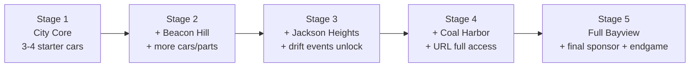

# UG2 Reverse-Spec — Full Throttle: Underground

> **Purpose:** Extract the *feel*, *systems*, *pacing*, and *technical architecture* of NFS Underground 2 into a clean, implementation-ready specification for a Unity game. This document does **not** describe copyrighted assets — it describes **behavior, structure, and sensation**.

> [!IMPORTANT]
> This spec is derived from structural analysis of the NFS Underground 2 install directory, community reverse-engineering documentation, and observable gameplay behavior. It is intended as a *design behavior reference*, not a copy blueprint.

---

## Table of Contents

1. [Core Driving Feel](#1-core-driving-feel)
2. [Player Progression Loop](#2-player-progression-loop)
3. [AI Race Behavior](#3-ai-race-behavior)
4. [Race/Event Presentation](#4-raceevent-presentation)
5. [Audio Architecture](#5-audio-architecture)
6. [World/Game Atmosphere](#6-worldgame-atmosphere)

---

## 1. Core Driving Feel

### 1.1 Design Philosophy

The handling is an **arcade-real hybrid**: responsive enough to be fun on the first corner, physical enough that the car has weight. The player should always feel like they *chose* to slide — never that they lost control by accident.

| Principle | Description |
|---|---|
| **Instant throttle** | Full power arrives within 1–2 frames of input. No turbo lag at low RPM. |
| **Predictable rear** | Rear tires break away progressively, never snap-oversteer. |
| **Recoverable slides** | A slide can always be corrected if the player counter-steers in time. |
| **Speed-sensitive steering** | Turn rate reduces at high speed to prevent twitchiness. |
| **Visible weight transfer** | Braking loads front; throttle loads rear. Not simulated per-spring, but felt through pitch animation and grip shift. |

### 1.2 Throttle / Brake / Steering Response

#### Throttle
- **Input curve:** Near-linear with slight dead zone (0.02–0.04).
- **Application rate:** Exponentially smoothed, ~15–20 Hz response.
- **Torque delivery:** Immediate. No realistic turbo spool delay on throttle application.
- **Lift-off behavior:** Instant deceleration sensation. Engine braking is mild but audible (decel sweep plays).

#### Brake
- **Input curve:** Linear, no dead zone.
- **Application rate:** Faster than throttle (~25 Hz response). Braking feels immediate.
- **ABS simulation:** None. Full lock under heavy braking reduces steering authority slightly.
- **Weight transfer:** Braking visibly pitches the car forward (nose dip), shifting grip to front axle.

#### Steering
- **Base response:** Quick turn-in. Steering ratio feels ~14:1 equivalent.
- **Speed attenuation:** High-speed steering input is reduced to ~35–40% of low-speed authority.
- **Counter-steer assist:** Mild automatic counter-steer smoothing when rear slip exceeds threshold (~12–15° slip angle).
- **Dead zone:** Minimal (0.02), nearly 1:1 stick-to-wheel at low speed.

```
Unity Implementation Notes:
- Use WheelCollider sidewaysFriction / forwardFriction curves, NOT raw Rigidbody torque.
- Speed-sensitive steering: Mathf.Lerp(1.0, 0.35, speed / maxSpeed)
- Counter-steer: blend toward velocity direction when slipAngle > threshold.
- Expose all values via ScriptableObject "HandlingProfile".
```

### 1.3 Drift / Slip Behavior

The drift model is **handbrake-initiated** oversteer with a **forgiving sustain window**.

| Parameter | Observed Value |
|---|---|
| **Initiation** | Handbrake tap reduces rear grip by ~60–70% for 0.3–0.5s |
| **Sustain** | Throttle modulation + counter-steer maintains drift angle |
| **Snap-back protection** | Yaw correction force applied when angle > ~45° to prevent spin |
| **Exit behavior** | Releasing throttle gently straightens the car over ~0.5s |
| **Speed loss during drift** | Mild — roughly 5–15% speed penalty vs. clean grip cornering |
| **Drift scoring (events)** | Angle x speed x duration. Wall contact kills the combo. |

```
Unity Implementation Notes:
- Apply rear WheelCollider friction multiplier (0.3–0.4) during handbrake.
- Add subtle yaw-assist torque in drift direction (not auto-rotation).
- Track slipAngle for drift scoring: atan2(localVelocity.x, localVelocity.z).
- Snap-back guard: if abs(slipAngle) > 45deg, add corrective torque.
```

### 1.4 Arcade Grip Model

This is NOT a tire-simulation. It uses **simplified grip circles**.

- **Front axle:** High lateral grip, moderate longitudinal. Understeer-biased at limit.
- **Rear axle:** Moderate lateral grip, high longitudinal. Breaks away progressively under power.
- **Four-wheel behavior:** All cars feel RWD-ish regardless of actual drivetrain. Front wheels mostly steer; rear wheels mostly push.
- **Surface friction:** Essentially one surface type (asphalt). Wet conditions reduce grip by ~10–15%.
- **Collision recovery:** Cars bounce off walls with high restitution but low speed loss. No crumple simulation.

```
Unity Implementation Notes:
- WheelCollider friction curves: stiffness 1.0–1.6 range.
- Asymmetric front/rear: front sideways stiffness > rear by 15–25%.
- Single surface PhysicsMaterial for all roads.
- Wall bounce: OnCollision applies impulse reflection with 0.6–0.8 restitution.
```

### 1.5 Speed Sensation

Speed feeling comes from **visual techniques**, not just velocity numbers.

| Technique | Implementation |
|---|---|
| **FOV ramp** | 65 degrees idle to 86 degrees at max speed. Smooth lerp over 0.5s. |
| **Camera pullback** | Distance increases from 6m to 8.5m proportional to speed. |
| **Motion blur** | Radial blur intensity scales with speed. Strongest during NOS. |
| **NOS punch** | On activation: instant +8 degrees FOV spike, camera shake impulse, speed lines overlay, audio whoosh. |
| **Speed lines** | Particle system — thin streaks emanating from center of screen at high speed. |
| **Roadside rhythm** | Lampposts, barriers, lane markers at regular ~15m intervals create peripheral motion cadence. |
| **Tunnel compression** | Entering tunnels adds reverb + slight FOV compression + echo. |

### 1.6 Camera Behavior

#### Cruising (< 80 kph)
- Chase cam sits at `6.0m` behind, `2.0m` above.
- FOV: 65 degrees.
- Rotation smoothing: `8 Hz` slerp.
- Look-at target: `3m` ahead of car center.
- Minimal camera shake.

#### Cornering
- Camera lags rotation — car turns first, camera follows with ~0.15s delay.
- During sustained turn: slight lateral offset toward outside of turn (~0.3m).
- Drift mode: camera biases toward the slide direction to show the angle.
- FOV: no cornering change (stays speed-based).

#### Boosting / NOS
- Instant FOV spike: +8–12 degrees over 0.2s, decay over 1.5s.
- Camera pushes forward slightly (reduces distance by 0.5m temporarily).
- Speed shake intensity doubles.
- Motion blur spikes.
- Screen edges bloom/saturate.

#### Collision
- Camera dampens on impact — brief freeze-frame (~30ms) then smooth recovery.
- No violent camera whip. The camera stays composed.

```
Unity Implementation Notes:
- CinemachineVirtualCamera with custom CinemachineExtension for speed-FOV.
- Separate damping profiles for grounded vs airborne.
- NOS effect: coroutine with FOV spike + bloom intensity + camera push.
- Collision: OnCollisionEnter with brief Time.timeScale dip, then restore.
```

---

## 2. Player Progression Loop

### 2.1 Career Structure: 5 Stages

The career unfolds across **5 stages**, each gated by **sponsor contracts**. New stages unlock new city districts, cars, parts, and event types.



#### Stage Advancement Requirements
Each stage requires:
1. **Win N URL (league) races** — formal tournament events.
2. **Win N races of player's choice** — any type.
3. **Complete sponsor-specific races** — marked on map.

### 2.2 Garage Flow

| Step | Behavior |
|---|---|
| **Entry** | Player drives to garage icon on map OR accesses from menu. |
| **Camera** | Slow orbit around player car in stylized garage environment. |
| **Options** | Browse owned cars - Select active car - View stats - Access shops (sub-menu) |
| **Car lot** | Separate shop to buy new cars. Each stage unlocks new purchasable vehicles. |
| **Exit** | Camera transitions to exterior, player spawns at garage door in free-roam. |

#### Shop Types (from install `FRONTEND/PLATFORMS/`)

| Shop | Install File | Purpose |
|---|---|---|
| Performance | `PerfShop01.BIN` | Engine, turbo, transmission, suspension, tires, brakes, NOS |
| Body / Parts | `PartsShop01.BIN` | Body kits, bumpers, spoilers, hoods, mirrors, roof scoops |
| Paint | `PaintShop01.BIN` | Color, vinyl layers, decals |
| Audio | `AudioShop01.BIN` | Trunk audio systems (cosmetic/visual rating) |
| Car Lot | `CarLot01.BIN` | Purchase new vehicles |
| Specialty (hidden) | `MegaloShop01.BIN` | Unique parts, discovered by exploration |

### 2.3 Upgrade Flow

Performance upgrades follow a **4-tier system** derived from the audio bank structure:

| Tier | Label | Effect |
|---|---|---|
| 0 | **Stock** | Factory defaults. Mild power, stock sound. |
| 1 | **Street** | +15-25% power. New intake/exhaust sound character. |
| 2 | **Pro** | +25-40% power. Turbo becomes audible. Shift points change. |
| 3 | **Extreme** | +40-60% power. Full turbo, aggressive exhaust, fastest shift pattern. |

Each tier affects:
- Engine power / torque curve
- Top speed
- Gear ratios (via dyno tuning)
- Audio tier (separate sound bank per tier)
- Visual star rating

#### Dyno Tuning
The player can fine-tune:
- **Gear ratios** (shorter for acceleration, taller for top speed)
- **Suspension stiffness** (soft for drift, stiff for grip)
- **Turbo boost** (adjustable in Pro/Extreme tiers)

```
Unity Implementation:
- ScriptableObject "PerformanceTier" with torqueCurve, gearRatios[], topSpeed, etc.
- VehicleStats component reads current tier from save data.
- Audio system swaps tier package automatically via VehicleAudioTierSelector.
```

### 2.4 Event Unlock Flow

Events appear on the map as **colored markers** discovered by driving near them.

| Marker Color | Event Type |
|---|---|
| Blue ring | Circuit |
| Green ring | Sprint |
| Orange ring | Drift / Downhill Drift |
| Red ring | Drag |
| Purple ring | Street X |
| White star | URL (Underground Racing League) |
| Yellow triangle | Outrun (triggered by proximity to AI car in free-roam) |

**Discovery mechanic:** Hidden events reveal when the player drives within ~50m. An SMS notification appears in the HUD.

### 2.5 World Traversal Loop

```
Free-Roam -> Discover Event Marker -> Drive to Event -> 
Pre-Race Screen -> Race -> Results/Rewards -> 
Free-Roam (continue or visit shop) -> Repeat
```

Key feelings:
- **Never taken out of the world.** Events start from the road. No loading screen to enter most races.
- **Always something nearby.** Event density ensures the player is never more than 30-45s of driving from a race.
- **Exploration rewarded.** Hidden shops, shortcut discoveries, Outrun opponents found in the world.

### 2.6 Race / Event Categories

| Category | Description | NOS | Traffic | Laps/Format |
|---|---|---|---|---|
| **Circuit** | Closed loop, 2-4 laps | Yes | Yes (light) | Multi-lap |
| **Sprint** | Point A to B | Yes | Yes | One-way |
| **Drift** | Score by maintaining drift angle x speed | Yes | Optional | Scored laps |
| **Downhill Drift** | Drift on downhill route with traffic | Yes | Yes | Target score |
| **Drag** | Straight-line speed + gear timing | Auto-shift optional | Yes (must dodge) | Quarter-mile segments |
| **Street X** | Tight closed course, no NOS | **No** | No | Multi-lap |
| **URL** | Formal tournament, multiple heats | Yes | No | Tournament bracket |
| **Outrun** | Free-roam 1v1, get 300m+ ahead to win | Yes | Yes | Distance-gap |

### 2.7 Reward Pacing

| Phase of Career | Cash per Win | Rep per Win | New Unlocks |
|---|---|---|---|
| Stage 1 (early) | $500-1,500 | Low | First car, basic parts |
| Stage 2 | $1,500-3,000 | Medium | New district, body kits, paint |
| Stage 3 | $3,000-5,000 | Medium-High | Drift events, hidden shops |
| Stage 4 | $5,000-8,000 | High | URL full access, high-tier parts |
| Stage 5 | $8,000-15,000 | Very High | Final cars, unique parts, endgame |

**Outrun wins** unlock **unique parts** — one-of-a-kind performance upgrades that cannot be purchased. These are missable per stage.

**Magazine covers** trigger when the car's visual **star rating** exceeds thresholds. They are cosmetic milestone rewards.

---

## 3. AI Race Behavior

### 3.1 Rubberbanding / Catch-Up Logic

UG2 uses aggressive, distance-based dynamic difficulty.

| Condition | AI Behavior |
|---|---|
| Player far ahead (>5s gap) | AI receives acceleration multiplier (~1.2-1.4x). Referred to as "catapult" effect. |
| Player slightly ahead (1-3s) | AI performs at designed skill level. Normal behavior. |
| Player behind (>3s) | AI is "nerfed" — reduced top speed / wider lines / more mistakes. |
| Final lap, player leading | Catch-up intensifies. AI often makes a late surge. |

> [!WARNING]
> The catch-up system is one of UG2's most criticized features. For Full Throttle, implement catch-up **subtly** — use difficulty-based speed clamping rather than rubber-band acceleration spikes.

```
Unity Implementation:
- float catchUpMultiplier = Mathf.Lerp(1.0, catchUpStrength, gapNormalized);
- Apply to AI engineForce, NOT to AI top speed (prevents unnatural slingshots).
- Configurable per-difficulty: Easy (0.15), Medium (0.08), Hard (0.03).
- Never exceed 1.15x base acceleration.
```

### 3.2 Aggression

| Situation | Aggression Level |
|---|---|
| Open road, no player nearby | Low — AI follows ideal racing line. |
| Close to player, side by side | Medium — AI defends inside line, mild door-to-door. |
| Behind player, last lap | High — AI takes riskier lines, brakes later, may attempt dive-bomb. |
| Leading comfortably | Low — AI maintains pace, does not push beyond safe speed. |

Aggression is NOT contact-based violence. AI does not PIT-maneuver the player. Aggression = willingness to take tighter lines, brake later, and sacrifice corner exit for position.

### 3.3 Lane / Path Behavior

- AI follows **spline-based waypoint paths** (evidenced by `Routes*F.bin` / `Routes*B.bin` files — forward/backward route variants).
- Each route has **multiple path variants** (`Paths*.bin` files) allowing different racing lines.
- AI selects paths based on:
  - Proximity to player
  - Current traffic positions
  - Random variation seed per lap
- AI does NOT have perfect pathfinding. It follows the predetermined routes with minor random offsets.

```
Unity Implementation:
- BezierSpline route per track, baked at event generation.
- 2-3 lane variants per segment (inside, middle, outside).
- AI selects lane at each segment based on: position, traffic query, random weight.
- Lookahead: 12-20m, scaled by current speed.
```

### 3.4 Mistake Frequency

| Mistake Type | Frequency | Severity |
|---|---|---|
| **Braking slightly late** | ~1 per 4-6 corners | Loses 0.3-0.8s |
| **Clipping curb / wall** | ~1 per 8-12 corners | Speed scrub, no crash |
| **Suboptimal line** | ~2 per lap | Wider exit, minor time loss |
| **Oversteer on corner entry** | ~1 per 2-3 laps | Brief slide, recovers naturally |
| **Traffic collision** | ~0.5-1 per race (if traffic present) | Major time loss, 2-5s |

Mistakes should feel **organic** — variable timing, variable severity. Never every 3 seconds. Never dramatic enough to make AI look broken.

### 3.5 Start / Launch Behavior

- AI uses a **reaction time window** (0.1-0.4s) after "GO" before applying throttle.
- Better AI slots (P1-P2) have faster reactions (~0.1-0.2s).
- Weaker AI slots (P5-P6) are slower (~0.3-0.5s).
- All AI apply full throttle at launch — no wheel spin simulation.
- AI in front positions often lead into first corner; pack naturally separates over first 10-15s.

---

## 4. Race/Event Presentation

### 4.1 Pre-Race Flow

```
[Free-Roam] -> Drive to event marker -> 
[Event Trigger] -> Brief camera flyover of track route (~3s) ->
[Car Lineup] -> Player car + AI opponents shown at starting grid ->
[HUD appears] -> Race type + lap count displayed ->
[Countdown begins]
```

- **No loading screen** for most events. The race starts on the same road.
- URL events transition to a separate venue (airport, closed course) — these have a brief load.

### 4.2 Countdown

| Beat | Timing | Visual | Audio |
|---|---|---|---|
| "3" | T - 3.0s | Large numeral, center screen | Deep tone |
| "2" | T - 2.0s | Large numeral | Rising tone |
| "1" | T - 1.0s | Large numeral | Higher tone |
| "GO" | T - 0.0s | Flash burst, HUD fully appears | Burst + rev limiter release |

Duration: exactly 3 seconds. Engine revs are audible during countdown. Player CAN rev during countdown but car is held.

### 4.3 HUD Priorities

**Primary (always visible):**

| Element | Position | Notes |
|---|---|---|
| **Speedometer** | Bottom-right | Large, digital. Shows current speed in mph or kph. |
| **Tachometer** | Bottom-right (arc behind speedo) | Needle gauge or LED bar. Shows RPM band. |
| **NOS gauge** | Bottom-center or near speedo | Shows remaining NOS charge. |
| **Position** | Top-right | "1st / 6" format. |
| **Lap counter** | Top-right (below position) | "Lap 2 / 3" |

**Secondary (contextual):**

| Element | Condition | Notes |
|---|---|---|
| **Minimap** | Always in free-roam, optional in race | Shows route, nearby events, shops. |
| **Drift score** | Drift events only | Running combo score, multiplier. |
| **Wrong way** | Player driving backwards | Large red warning, center screen. |
| **Checkpoint arrow** | Sprint events | Directional indicator to next checkpoint. |
| **SMS notification** | New unlock / discovery | Small popup, lower-left. Dismissible. |

### 4.4 End-of-Race Flow

```
[Cross Finish Line] -> Slow-motion replay highlight (~2-3s) ->
[Results Screen] -> Position, time, cash earned, rep earned ->
[Unlock Notification] (if applicable) -> New part / car unlocked ->
[Continue] -> Return to free-roam OR retry
```

- **Win:** Celebratory camera sweep around car. Results with earnings.
- **Loss:** Muted camera. "Retry / Exit" prompt. No penalty.
- **Outrun win:** Immediate victory sting when gap exceeds 300m. No formal results screen.

### 4.5 Reward Screens

| Element | Display |
|---|---|
| **Cash earned** | Dollar amount, animated count-up. |
| **Rep earned** | Rep bar fills. If threshold crossed, notification of new sponsor availability. |
| **New unlock** | Part icon + name. "New Performance Part Available!" |
| **Career progress** | Brief sponsor contract progress bar update. |

### 4.6 Map and Navigation

- **Persistent minimap** during free-roam showing roads, event icons, shop icons, and player arrow.
- **GPS route line** drawn on minimap when player selects an event or shop destination.
- **Full-screen map** accessible via pause menu with pan/zoom.
- Event icons are **color-coded by type** (see section 2.4).
- **Undiscovered events** do not appear until the player drives near them.

---

## 5. Audio Architecture

> [!NOTE]
> This section is derived from direct analysis of the `SOUND/` directory structure in the NFS UG2 install, cross-referenced with the existing `VehicleAudioController.cs` and `README_FullThrottle_NFSU2_ArchiveFaithful_AudioSystem.md` in the project.

### 5.1 Engine Audio — Layered Bank System

The engine sound is NOT a single pitched loop. It is a **multi-band crossfade system** with **character sweep overlays**.

#### Primary: Engine Loop Bank (8 bands)

Source files: `CAR_##_ENG_MB_EE.abk` (exterior) / `CAR_##_ENG_MB_SPU.abk` (interior)

Each car has up to **41 unique engine audio sets** (CAR_00 through CAR_40), containing 8 RPM-mapped loop bands:

| Band | RPM Range | Role |
|---|---|---|
| Band 01 | Idle - 1500 | Idle presence, low rumble |
| Band 02 | 1500 - 2500 | Low-rev pull |
| Band 03 | 2500 - 3500 | Low-mid transition |
| Band 04 | 3500 - 4500 | Mid-range body |
| Band 05 | 4500 - 5500 | Mid-high character |
| Band 06 | 5500 - 6500 | High-rev strain |
| Band 07 | 6500 - 7500 | Top-end scream |
| Band 08 | 7500 - Redline | Limiter / redline buzz |

**Crossfade rule:** At any RPM, only 2 adjacent bands are active, blended by normalized RPM position within the transition window. This prevents spectral mud.

```
Unity: CalculateTwoBandWeights() in VehicleAudioController.cs already implements this.
Only the two nearest bands play. All others are silent.
```

### 5.2 Accel / Decel Character Sweeps

Source files: `GIN_*.gin` (accel) / `GIN_*_DCL.gin` (decel)

These are **full RPM sweep recordings** of real engines. They are NOT loops — they are long one-shot recordings that the runtime seeks through based on current RPM.

| Layer | Source Pattern | Volume | Role |
|---|---|---|---|
| **Accel sweep** | `GIN_Honda_S2000_5zigen.gin` | Low (0.15-0.25) | Adds character color on throttle |
| **Decel sweep** | `GIN_Honda_S2000_5zigen_DCL.gin` | Low (0.12-0.20) | Adds overrun character on lift-off |

**Playback rule:** The runtime seeks the sweep file to the position matching current RPM normalized 0-1. Pitch stays near 1.0 because the recording already contains the RPM change.

**Critical:** These are **character layers**, NOT the main engine body. The loop bank is always dominant.

### 5.3 Sweetener / Sputter / Spark Chatter

Source files: `SWTN_CAR_##_MB.abk`

| Sweetener Type | Trigger | Volume |
|---|---|---|
| **Intake** | Proportional to throttle x RPM | 0.15-0.20 |
| **Drivetrain** | Proportional to speed + RPM | 0.10-0.15 |
| **Sputter** | On lift-off at high RPM | 0.08-0.15 |
| **Spark chatter** | Random on lift-off, chance-based | 0.05-0.10 |
| **Crackle** | Random on lift-off above crackle RPM threshold | 0.05-0.08 |

### 5.4 Shift Sounds

Source directory: `SOUND/SHIFTING/`

Shift banks are organized by **car size class** and **performance tier**:

| Size Class | Files | Description |
|---|---|---|
| Small (SML) | `GEAR_SML_Base` / `Lev1` / `Lev2` / `Lev3` | 4-cylinder, compact cars |
| Medium (MED) | `GEAR_MED_Base` / `Lev1` / `Lev2` / `Lev3` | 6-cylinder, sports cars |
| Large (LRG) | `GEAR_LRG_Base` / `Lev1` / `Lev2` / `Lev3` | V8, muscle cars |
| Truck (TK) | `GEAR_TK_Base` / `Lev1` / `Lev2` / `Lev3` | SUVs, trucks |

`Base` = Stock tier. `Lev1/2/3` = Street/Pro/Extreme.

**Shift behavior:**
- On up-shift: brief engine duck (0.05-0.1s), shift one-shot plays, RPM drops by pitch multiplier.
- On down-shift: shift one-shot plays, RPM rises slightly.
- Cooldown between shift sounds: ~0.3s to prevent spam.

### 5.5 Turbo Audio

Source directory: `SOUND/TURBO/`

Turbo banks are organized by **turbo size class**:

| Size Class | Files | Count |
|---|---|---|
| Small Type 1 | `TURBO_SML1_0/1/2_MB.abk` | 3 tiers |
| Small Type 2 | `TURBO_SML2_0/1/2_MB.abk` | 3 tiers |
| Medium | `TURBO_MED_0/1/2_MB.abk` | 3 tiers |
| Big | `TURBO_BIG_0/1/2_MB.abk` | 3 tiers |
| Truck | `TURBO_TRUCK_0/1/2_MB.abk` | 3 tiers |

Each tier (0/1/2) maps to performance upgrade level.

**Turbo audio layers:**

| Layer | Behavior |
|---|---|
| **Spool** | Continuous loop, volume proportional to `turboSpool01` (throttle x RPM). Low volume (~0.28). |
| **Whistle** | Layered on top of spool when RPM > threshold AND throttle > threshold. Very quiet (~0.16). |
| **Blow-off** | One-shot triggered when throttle drops sharply AND spool is high. The characteristic "pssh" / "stu-tu-tu". |

### 5.6 Skid / Tire Audio

Source directory: `SOUND/SKIDS/`

| File | Purpose |
|---|---|
| `SKIDS_DRIFT_MB.abk` | Primary drift skid loop |
| `SKIDS_DRIFT2_MB.abk` | Secondary drift variation |
| `SKID_PAV_MB.abk` | Pavement skid (braking) |
| `SKID_PAV2_MB.abk` | Pavement skid variation |

**Behavior:**
- Volume proportional to wheel slip magnitude.
- Pitch stays near 1.0 (no significant pitch shift).
- Crossfade between drift-type and braking-type based on whether handbrake or brake is active.

### 5.7 Road / Wind / Environment

Source directory: `SOUND/IG_GLOBAL/`

| File | Layer |
|---|---|
| `ROADNOISE_00_MB.abk` | Tire-on-road continuous hum. Volume scales with speed. |
| `WIND_00_MB.abk` / `WIND_01_MB.abk` | Wind rush. Volume ramps above ~60 kph. Loudest at 200+ kph. |
| `ENV_COMMON_MB.abk` | Ambient city — distant traffic hum, urban atmosphere. |
| `TRAFFIC_MB.abk` | Close-proximity traffic pass-by whooshes. |
| `FX_MAIN_MEM_MB.abk` | Impact/collision sounds. |
| `FX_Misc_MB.abk` | Miscellaneous world SFX. |
| `FX_Rain_MB.abk` | Rain ambience layer. |
| `MB_Stich_Collision.abk` | Collision stitch sounds (crunch/scrape). |
| `MB_Stitch_Whoosh.abk` | Close-pass air displacement. |

### 5.8 NOS Audio

Source directory: `SOUND/NOS/`

| File | Purpose |
|---|---|
| `Nitrous_00_MB.abk` | NOS activation surge |
| `Nitrous_01_MB.abk` | NOS sustained whoosh |
| `Hydraulics_00_MB.abk` | Hydraulics system SFX (cosmetic) |

**NOS audio behavior:**
- Activation: one-shot burst (Nitrous_00).
- Sustained: looping whoosh (Nitrous_01) while NOS is active.
- Both layers play simultaneously.

### 5.9 Interior / Exterior Blend

The audio system supports **interior and exterior variants** of every engine layer.

| Camera Position | Behavior |
|---|---|
| **External (chase cam)** | Exterior sources play at full volume. Interior sources muted. |
| **Internal (cockpit/bumper)** | Interior sources play. Exterior muted. All frequencies are muffled/filtered. |
| **Transition** | Smooth crossfade over ~0.3s based on camera distance to car center. |

```
Unity: interiorBlend float (0 = exterior, 1 = interior).
Each LoopPairRuntime has .Exterior and .Interior AudioSource.
Volume: exterior *= (1 - interiorBlend), interior *= interiorBlend.
```

### 5.10 Audio FX Environments

Source directory: `SOUND/FXEDIT/`

The game uses **reverb zone presets** for different environments:

| Preset | Context |
|---|---|
| `Garage.fx` / `Garage_Sml.fx` | Garage interior — warm, enclosed reverb |
| `Simple_Tunnel.fx` / `Simple_Tunnel_Sml.fx` | Road tunnels — echo, metallic reflections |
| `Alley.fx` | Narrow streets — tight early reflections |
| `City_Dense.fx` | Downtown — moderate urban reverb |
| `City_Open.fx` | Open roads — minimal reverb, wide space |
| `Hills.fx` / `Hills_Close.fx` | Mountain roads — distant echo |
| `Car_Show_Bass.fx` / `Car_Show_Sml.fx` | Car show / magazine events — heavy bass reverb |

```
Unity: Use AudioReverbZone or AudioReverbFilter per area.
Trigger zones placed in world generation pipeline.
Tunnel/garage detection via trigger colliders.
```

### 5.11 Per-Race-Mode Mix Maps

Source directory: `SOUND/MIXMAPS/`

| File | Mode | Notes |
|---|---|---|
| `MAPOUTPUT.mxb` | Default / Free-roam | Standard mix balance |
| `MAPOUTPUTDFT.mxb` | Drift | Skid and drift sounds boosted |
| `MAPOUTPUTDRG.mxb` | Drag | Engine and shift sounds prioritized, wind reduced |
| `MAPOUTPUTURL.mxb` | URL | Clean racing mix, no traffic audio |

```
Unity: ScriptableObject "AudioMixProfile" per race mode.
Swap active mix profile on race start.
Adjust bus volumes: Engine, Turbo, Skid, Environment, Traffic, Music.
```

### 5.12 Event System Audio

Source directory: `SOUND/EVT_SYS/`

| File | Purpose |
|---|---|
| `UG2_MAIN_AEMS.csi` | Main gameplay audio events |
| `UG2_ENGINES_AEMS2.csi` | Engine sound event triggers |
| `UG2_ENVIRO_AEMS.csi` | Environment audio events |
| `UG2_FE_AEMS.csi` | Frontend / menu audio events |
| `UG2_STITCH_AEMS.csi` | Collision stitch event triggers |
| `UG2_TURBO.csi` | Turbo audio events |

These are **event dispatch tables** — they define which sound banks trigger for which gameplay events.

---

## 6. World / Game Atmosphere

### 6.1 Night Street-Racing Tone

UG2 exists in a **perpetual dusk-to-night** world. The game almost never shows broad daylight.

| Time Window | Visual Character |
|---|---|
| **Late evening** (~7-9 PM feel) | Warm amber sky, long shadows, golden hour glow. |
| **Night** (~10 PM - 2 AM feel) | Dark blue-black sky. Neon signs and streetlights dominate. Wet road reflections. |
| **Pre-dawn** (~3-5 AM feel) | Cool blue-grey. Fewer NPCs. Quieter atmosphere. |

**Key visual ingredients:**
- **Wet road reflections** — roads always have slight specular sheen, even without rain.
- **Neon signage** — shops, gas stations, and billboards glow with saturated colors.
- **Undercarriage neon** — player car emits colored underglow.
- **Street light pools** — regular cones of warm light along roads create rhythm.
- **Volumetric haze** — subtle atmospheric fog adds depth layering.
- **Bloom on light sources** — all point lights have soft bloom.

```
Unity (HDRP):
- Exposure curve: dark enough for emissives to pop, bright enough to read corners.
- Bloom: moderate intensity, wide radius.
- Screen Space Reflections: on for wet roads.
- Volumetric fog: density 0.02-0.05, no distance clipping.
- Emissive materials: HDR color values for neon (10-50 intensity).
```

### 6.2 Visual Pacing

The world is designed so the **visual density increases** as the player approaches interesting areas:

| Zone Type | Visual Density | Purpose |
|---|---|---|
| **Highways** | Low — barriers, lampposts, signs at regular intervals | Maximum speed sensation from peripheral motion |
| **Suburban** | Medium — houses, trees, parked cars | Transition zone, mild exploration |
| **City streets** | High — shop fronts, neon, traffic, pedestrian areas | Event-dense, lots of visual stimulation |
| **Industrial** | Medium-High — warehouses, cranes, containers, fencing | Gritty, wide racing surfaces |
| **Docks / Airport** | Structured — runways, hangars, shipping containers | URL / formal racing venues |

### 6.3 Garage Vibe

The player's garage is a **converted warehouse / underground space**:
- Concrete floor with polished center pad for the car.
- Industrial overhead lighting — warm tungsten, slightly dim.
- Tool racks, lift equipment, parts boxes visible but not interactive.
- The car sits on a **rotating platform** that slowly spins in browse mode.
- **Music continues** from free-roam radio. Genre-appropriate (hip-hop / electronic / rock).

```
Unity:
- Single scene or prefab: "Garage_Environment"
- Slow orbiting camera: CinemachineFreeLook with auto-orbit.
- Rotating platform: turntable script, 5 degrees/sec.
- Lighting: HDRP area light, warm color temp (3200K), moderate intensity.
```

### 6.4 Menu Vibe

The frontend menus have a specific aesthetic:

| Element | Character |
|---|---|
| **Typography** | Bold sans-serif, condensed. Often capitalized. |
| **Color palette** | Dark background (near-black), cyan/blue accents, white text. |
| **Transitions** | Slide-in/fade animations. Menu items animate on hover. |
| **Background** | Blurred or stylized render of the city / current car. |
| **Sound design** | UI blips, whooshes on transition. Confirm/cancel tones. |
| **Music** | Licensed soundtrack or original electronic/hip-hop. Continues from gameplay. |

Frontend platform environments (from `FRONTEND/PLATFORMS/`):
- `Showroom.BIN` — car display pedestal for viewing
- `Crib01.BIN` — player's home base / save point
- Each shop type has its own 3D environment with unique props

### 6.5 Event Discovery Feeling

The game creates a **constant feeling of opportunity** through:

1. **SMS messages** — pop up during free-roam informing of new events, shops, or sponsor opportunities.
2. **Visible markers** — colored icons on roads that glow at night.
3. **AI challengers** — orange-triangle Outrun opponents prowling the streets.
4. **Progressive map reveal** — unexplored areas are dimmed on the map until driven through.
5. **Shortcut discovery** — finding hidden routes or alleys triggers discovery notifications.
6. **Shop proximity** — driving near a hidden shop "discovers" it permanently on the map.

**Emotional target:** The player should feel like the city is *alive with racing culture* — not a static menu of events, but a world where races happen organically on real streets.

---

## Appendix A: Install Directory to System Mapping

| Install Directory | System Domain | Unity Equivalent |
|---|---|---|
| `CARS/` (63 vehicle dirs) | Vehicle roster + customization parts | `PlayerCarCatalog` ScriptableObject |
| `CARS/AUDIO/` | Audio system mesh references | `VehicleAudioController` |
| `CARS/WHEELS/` (20+ wheel brands) | Wheel customization | `WheelCatalog` ScriptableObject |
| `CARS/SPOILER/` / `EXHAUST/` / `ROOF/` | Part categories | `PartCategory` enum |
| `SOUND/ENGINE/` (210 files) | Engine audio bank system | `NFSU2CarAudioBank` per vehicle |
| `SOUND/SHIFTING/` (16 files) | Gear shift audio | Shift package in audio bank |
| `SOUND/TURBO/` (15 files) | Turbo audio package | Turbo package in audio bank |
| `SOUND/SKIDS/` (4 files) | Tire skid audio | Skid package in audio bank |
| `SOUND/NOS/` (3 files) | Nitrous audio | NOS one-shots |
| `SOUND/IG_GLOBAL/` (10 files) | World/environment audio | Ambient audio manager |
| `SOUND/FXEDIT/` (12 presets) | Reverb zones | `AudioReverbZone` per area |
| `SOUND/MIXMAPS/` (4 files) | Per-mode audio mix | `AudioMixProfile` per race type |
| `SOUND/EVT_SYS/` (8 files) | Audio event dispatch | Event-driven AudioSource triggers |
| `TRACKS/` (8 region bundles) | World geometry + routes | World generation pipeline |
| `TRACKS/ROUTESL4R*/` | Race route splines (F/B variants) | `RaceRoute` ScriptableObjects |
| `TRACKS/TRACKMAP*.BIN` (100+ files) | Minimap tiles per area | Minimap texture atlas |
| `FRONTEND/PLATFORMS/` (8 environments) | Shop/garage 3D scenes | Scene prefabs |
| `GLOBAL/InGame*.bun` | Per-mode HUD/UI assets | UI prefabs per race type |
| `GLOBAL/HUD_CustomTextures_*.bin` | HUD theme variants | HUD skin system |
| `NIS/` (77 files) | Cutscenes + camera scripts | Timeline / Cinemachine sequences |
| `MOVIES/` (30 files) | FMV story scenes + tutorials | VideoPlayer clips |
| `SDATA/sdat.viv` (259 MB) | Game simulation data archive | Physics/tuning ScriptableObjects |

---

## Appendix B: Vehicle Roster Reference

The install contains **29+ player-drivable car directories** and **12+ traffic/NPC vehicle types**:

### Player Cars (from `CARS/`)
240SX, 350Z, 3000GT, A3, Celica, Civic, Corolla, Eclipse, Escalade, Focus, G35, Golf, GTO, Hummer, Impreza, ImprezaWRX, IS300, Lancer, LancerEvo8, Miata, MustangGT, Navigator, Neon, Peugot, RSX, RX7, RX8, S2000, Sentra, Skyline, Supra, Tiburon, TT

### Traffic / NPC Vehicles
4DR_Sedan, 4DR_Sedan02, Ambulance, Bus, Coupe, Firetruck, Hatchback, Hatchback02, Minivan, Panelvan, Parcelvan, Pickup, SUV, Taxi, Taxi02

---

## Appendix C: Recommended Unity Component Architecture

```
PlayerCar (root GameObject)
+-- Rigidbody
+-- VehicleDynamicsController        <-- Physics + handling
+-- GearboxSystem                    <-- Transmission + RPM
+-- InputReader                      <-- Input abstraction
+-- PlayerCarAppearanceController    <-- Visual customization
+-- VehicleAudioController           <-- This spec's audio system
|   +-- NFSU2ArchiveAudio (child)
|       +-- EngineBand_01_Exterior
|       +-- EngineBand_01_Interior
|       +-- ... (8 band pairs)
|       +-- AccelSweep_Exterior/Interior
|       +-- DecelSweep_Exterior/Interior
|       +-- TurboSpool_Exterior/Interior
|       +-- TyreSkid_Exterior/Interior
|       +-- OneShot_A
|       +-- OneShot_B
+-- VehicleAudioTierSelector         <-- Stock/Street/Pro/Extreme
+-- NitroSystem                      <-- NOS management
+-- DriftScoreTracker                <-- Drift event scoring

ScriptableObjects:
+-- NFSU2CarAudioBank                <-- Per-car audio definition
+-- HandlingProfile                  <-- Per-car handling tuning
+-- PerformanceTier                  <-- Upgrade tier stats
+-- RaceRoute                        <-- Per-event route spline
+-- AudioMixProfile                  <-- Per-mode audio balance
+-- PlayerCarCatalog                 <-- Vehicle roster definition
```

---

> [!TIP]
> **Implementation priority for feel-first development:**
> 1. Get the handling right (section 1) — the car must feel good before anything else matters.
> 2. Get the audio right (section 5) — engine sound sells speed more than visuals.
> 3. Get the camera right (sections 1.5, 1.6) — FOV + pullback + NOS punch = speed sensation.
> 4. Build one complete race loop (section 4) — countdown to race to results.
> 5. Add AI opponents (section 3) — competent but fallible.
> 6. Layer in progression (section 2) — rewards make the loop sticky.
> 7. Polish atmosphere (section 6) — the night city vibe ties everything together.
